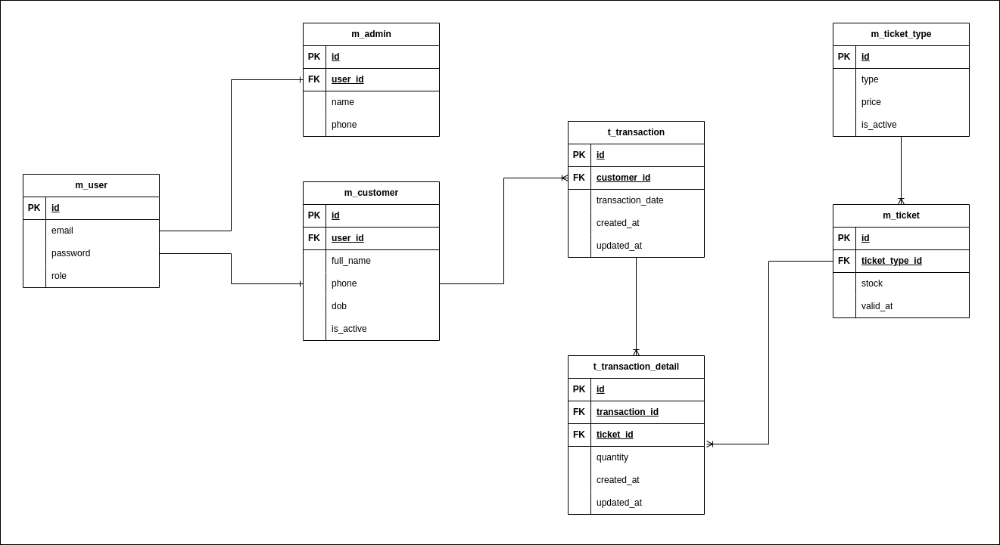

<p align="center">

<h3 align="center">Zoo Ticket API</h3>
</p>

### Built With

- [Springboot v3.2.4](https://spring.io/)
- [Java 17](hhttps://www.oracle.com/java/technologies/javase/jdk17-archive-downloads.html)
- [PostgreSQL](https://www.postgresql.org/docs/)
- [Swagger](https://realrashid.github.io/sweet-alert/)
- [Maven](https://maven.apache.org/)

### Prerequisites

This is an example of how to list things you need to use the software and how to install them.

- Java IDEA
- PgAdmin or other PostgreSQL DBMS
- Postman or other API Testing Apps<br/>
- Maven Build Tools

### Installation

1. Clone the repo
   ```sh
      https://github.com/maulanadityaa/zoo-ticket.git
   ```
2. Edit application.properties Config

   ```properties
   spring.datasource.username=YOUR_DATABASE_USERNAME
   spring.datasource.password=YOUR_DATABASE_PASSWORD
   spring.datasource.url=jdbc:postgresql://localhost:5432/YOUR_DATABASE_NAME
   spring.datasource.driver-class-name=org.postgresql.Driver
   spring.jpa.properties.hibernate.dialect=org.hibernate.dialect.PostgreSQLDialect
   spring.jpa.hibernate.ddl-auto=update
   spring.jpa.show-sql=true
   #JWT Secret
   app.zooticket.jwt.jwt-secret=YOUR_JWT_SECRET
   app.zooticket.jwt.app-name=Zoo Ticketting
   app.zooticket.jwt.jwt-expired=3600

   ```
3. Install all dependencies and run Maven reload

4. Then run the project

## API Endpoints

### Example Request

- Endpoint : ```/api/v1/transactions```
- Method : POST
- Header :
    - Content-Type: application/json
    - Accept: application/json
- Body :

```json
{
  "id": "string",
  "customerId": "string",
  "transactionDetails": [
    {
      "id": "string",
      "quantity": 0,
      "ticketId": "string"
    }
  ]
}
```

### Example Response

```json
{
  "statusCode": 201,
  "message": "Transaction created successfully",
  "data": {
    "id": "381261d8-8f1d-439a-b3d8-7aa2e349a7b8",
    "customerResponse": {
      "id": "e93b9bbd-3ac6-4a41-805e-95954d9e425b",
      "fullName": "Customer Name",
      "email": "cust@mail.com",
      "phone": "021846389136",
      "dateOfBirth": "2000-12-12",
      "userCredential": {
        "id": "6158d92c-5b46-4749-946d-f6de57664aaf",
        "username": "customer",
        "role": "ROLE_CUSTOMER"
      }
    },
    "transactionDate": "2024-03-27T19:53:47.383573153",
    "totalPrice": 440000,
    "transactionDetails": [
      {
        "id": null,
        "quantity": 4,
        "createdAt": "2024-03-27T19:53:47.383543782",
        "ticketResponse": {
          "id": "e227dba2-0462-4463-8011-c4b0fd697b5e",
          "stock": 66,
          "validAt": "2024-05-12",
          "ticketType": {
            "id": "438efe61-e76b-4501-9173-c43d55521e42",
            "ticketType": "WEEKDAY",
            "price": 110000,
            "status": "ACTIVE"
          }
        }
      }
    ]
  }
}
```

### Entity Relationship Diagram


<!-- CONTACT -->

## Contact

M Maulana Z Aditya -
Instagram - [@maulanadityaa](https://instagram.com/maulanadityaa)

Project Link: [https://github.com/maulanadityaa/zoo-ticket](https://github.com/maulanadityaa/zoo-ticket)
